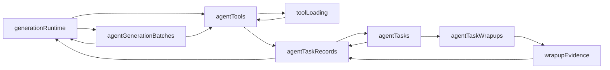

# 目录职责与依赖架构审查

基准：`2fc0e9523e62a5258a488cc3d0274d24c8967c6f`；日期：2026-09-30。统计来源：`tools/ast-results.json`，覆盖369个TS/TSX文件；不把代码行数直接作为缺陷。

## 当前职责及问题

现有结构按技术层分为 routes、components、domain、db、lib。规模较小时易于导航，但增长后缺少业务边界，`lib/agent`和`db/repo.ts`成为多种业务的汇合点。不能通过简单移动文件解决；需要先让业务规则和副作用有明确归属。

| 位置 | 当前承担的职责 | 已确认结构证据 | 建议边界 |
|---|---|---|---|
| `src/lib/agent` | 对话执行、工具加载、任务状态、证据汇总、上下文、图像视频、音频音乐、项目素材和记忆操作 | 66文件；与db之间有29条反向值引用和89条正向值引用；8文件值依赖环 | Agent核心保留协议/运行/上下文/工具执行，各业务工具作为适配器调用对应业务操作 |
| `src/db/repo.ts` | 项目/集/故事节拍/分镜/角色场景道具风格/媒体/连接配置/聊天记录 | 单个入口被39个源码模块值引用，导出遍布多个独立业务 | 按项目、故事分镜、资产、连接、聊天等稳定业务拆分；跨表操作有显式事务所有者 |
| `src/components/agent` | 页面、聊天、运行控制、工具审批、生成复核、任务总结、音频音乐、参考输入 | UI业务多且对应规则在db/lib/UI都有落点 | 先拆页面控制与展示，再按chat/run-review/tasks/context分组；业务工具展示留在对应能力附近 |
| `src/lib/projectPackage.ts` | ZIP编解码、数据验证、ID重映射、媒体迁移、记忆/参考/音频包、数据库写入 | 7个值调用者跨音视频、studio及workspace；导入导出是跨域事务 | 纯格式验证、ID映射与数据库导入边界分开，各业务贡献包片段；暂保留唯一原子导入协调器 |
| `src/domain/types.ts` | 各业务实体、默认值、规范化、状态和UI设置 | 模型不是纯类型集合，既描述契约又实现业务规则 | 按业务拆模型与纯规则，保留公共Id/媒体基础类型；不要先做只有转发作用的类型桶 |
| `src/db/database.ts` | Dexie schema、迁移和全局实例 | 126个源码模块直接值引用 | DB实例可集中，但修改入口应归属业务；只读实时查询不必强行套通用Repository |

`domain/agentGenerationBatch.ts`还通过类型引用依赖`lib/agent/generationProfiles.ts`。虽然不形成运行时循环，领域契约依赖执行实现的位置反映了契约归属反转，应将共享参数契约下沉到领域模块。

## ARCH-01：8文件值依赖环（P2，已确认结构债务）

最小双向环：
- `src/lib/agent/generationRuntime.ts:2` -> `src/db/agentGenerationBatches.ts:14` -> generationRuntime。
- `src/lib/agent/toolLoading.ts:3` -> `src/db/agentTools.ts:2` -> toolLoading。

两者通过agentTaskRecords、agentTasks、agentTaskWrapups、wrapupEvidence联通成同一强连通分量。AST与dependency-cruiser关闭类型边后的扫描交叉确认；不能将含类型边的工具循环直接算成值循环。



影响是模块初始化顺序和测试隔离更难理解，执行/证据/持久化无法局部演进。本轮未证明该环造成当前运行时故障，不能升级为已发生的初始化错误。

拆环顺序：
1. 将工具提供列表/权限推导等纯逻辑与`load_tool_groups`副作用拆开，使db不引用会执行数据库事务的工具加载模块。
2. 将generation target读取及batch归属验证移至业务数据查询模块，generationRuntime不再作为repository的查询入口。
3. 将来源合法性/证据规则与读写事务拆开，由上层任务操作协调所需repo；保留原有冻结快照、版本及审批账本语义。
4. 用值依赖图验证该强连通分量消失；相关工具审批、生成恢复、任务总结用行为测试验证。

## 目标结构：按业务归属组织，逐步迁移

下列是职责方向，不是要求创建全部目录或添加类。只有业务复杂度需要时才细分`ui/model/data/services`。

```text
src/
  routes/                    # 保留TanStack文件路由，参数和页面接入
  app/                       # 壳、页面组合、能力装配和初始化
  features/
    agent/                   # chat、run、context、审批协议及工具适配器
    projects/                # 项目/集与IP关联
    production/              # 故事、分镜、生成目标、批次与应用结果
    assets/                  # 角色/场景/道具/风格
    materials/               # 素材库、版本、使用记录
    audio/                   # 配音、时间线、播放导出
    music/                   # 草稿、生成复核、作品
    memory/                  # 记忆管理、查询与轻量信封
    references/              # 导入、解析、引用和证据
    project-transfer/        # 包契约、纯重映射、跨域原子导入
  shared/
    ui/                      # 无业务规则的通用控件
    lib/                     # ID、时间、纯格式等真正通用能力
  infrastructure/
    ai/                      # provider wire协议、请求/错误/取消
    persistence/             # Dexie实例、schema与历史迁移
```

依赖约束：路由/页面组合调用业务；业务UI调用本业务操作或受控实时查询；业务操作依赖本业务领域契约、数据访问及基础设施；纯领域规则不能依赖React、Dexie实例或Agent运行时；基础设施不能导入业务UI。Agent工具适配器可以调用业务操作，业务数据模块不反向调用Agent执行器。跨业务流程由明确操作协调，不为避环批量引入工厂、策略、注册中心。

## 迁移阶段及验收

1. 先建立质量基线和新增问题门禁，再修复确认的行为缺陷；避免一次目录搬迁掩盖行为变化。
2. 先拆8文件环中的纯规则/数据读取和副作用边界，保留对外API；验收值依赖图与审批/恢复行为。
3. 分解repo.ts的业务归属，暂保留兼容导出，逐个迁移调用者；确认无引用后移除兼容出口。跨业务deleteProject/ZIP导入仍有单一事务入口。
4. 拆大型页面的控制Hook、稳定子视图及业务操作。按职责抽取，不按固定行数截断；验收路由身份切换、草稿、撤销、取消及批量操作。
5. 最后整理features目录和契约导出，移除测试孤岛/旧实现的决策另列，生成文件与历史DB迁移不按未调用函数删除。

不要先把全部文件移动到新路径，也不要给每个函数套service类。项目仅有一次调用但负责数据边界的纯函数可以合理保留；同形CRUD也不意味着不同业务约束能统一。
