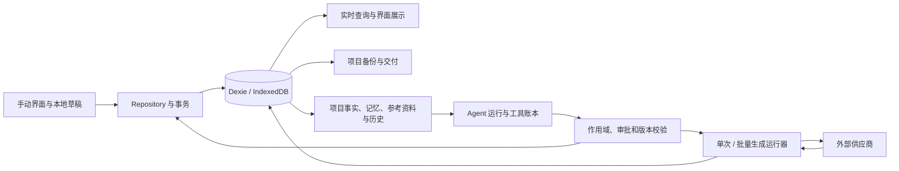

# Cuepoint 全盘代码与用户体验审查报告

审查日期：2026-09-21。代码基线：`988daf335aa7ebeb8b3e435a51bd3a3e9ceb033a`。范围：架构、数据、Agent/AI、代码维护性、浏览器体验、构建与发布。此次只新增审查文档、隔离复现脚本和证据，未修复或修改产品源码。

## 1. 总体判断

**项目具备较完整的基础保护，但不同功能入口之间已经出现规则分歧。当前最应优先修复的是跨标签页创作内容覆盖、已撤回资料重新进入模型请求，以及连接移除后仍提交生成任务。** 这些不是编译错误，因此现有 906 项测试全部通过，也没有覆盖住它们。

按根因合并后，确认 **13 项功能/信息展示问题：P1 3 项、P2 9 项、P3 1 项**；另记录 **2 项性能发现、1 项发布质量缺口和 4 组维护性债务**。没有确认 P0，但这不等于证明整个项目不存在 P0。对两个 Agent P1 做了另一名审查者的独立复核；数据覆盖 P1 在真实浏览器双标签页中复现。

这次完成了全量自有源码的静态审查和风险优先的动态验证。没有对所有分支、浏览器和供应商组合做穷举；具体未验证项见第 10 节，不能把静态审查覆盖率解释为行为测试覆盖率。

## 2. 范围、方法与基线

### 实际覆盖

| 项目 | 实际完成情况 |
| --- | --- |
| 自有代码 | 272 个 TS/TSX/CSS 文件、32,441 行；其中 99 个源码文件作重点深读，其余静态阅读与调用核对 |
| 源目录其他内容 | 模型库 README 已查阅；3 个生成文件检查生成/快照边界，不逐条认定外部模型数据正确 |
| 文件台账 | 362 项：源码、测试、脚本、配置和部署文件均有审查处置记录；无未说明的 pending 项 |
| 路由 | 全部 42 个路由文件静态检查；浏览器对 22 个代表性 URL 做 3 种视口冒烟，另验证具体 Agent 会话和生成目标导航 |
| 现有自动化测试 | 基线 72 文件 / 906 测试全部通过；测试导入映射已建，未声称逐条人工证明所有断言充分 |
| 缺陷最小复现 | 数据 3 个失败断言 + 1 个通过的历史迁移；Agent 6 个失败断言证明 5 类问题；UI 4 类问题在浏览器复现 |
| 独立复核 | Agent 资料撤回、上传后连接校验两个高优先级问题再次追链和运行复现 |
| 浏览器 | 隔离 Microsoft Edge Chromium 153.0.4234.48；实际版本以 JSON 证据为准；1440×900、1024×768、390×844 |
| 数据安全 | 全部合成项目、fake-indexeddb 或新建浏览器上下文；没有清理用户浏览器数据；网络生成/聊天用模拟响应 |

台账：[coverage-files.csv](./coverage-files.csv)。专项：[数据审查](./evidence/data-review.md)、[Agent 审查](./evidence/agent-review.md)、[界面审查](./evidence/ui-review.md)、[独立复核](./evidence/independent-review.md)。台账中的 reviewed 表示已读，verified 也仅代表注明的检查已经执行。

### 质量命令结果

| 检查 | 结果 | 说明 |
| --- | --- | --- |
| TypeScript (`pnpm lint`) | 通过，约 5.9 秒 | 这是类型检查，不是完整语义或交互检查 |
| Vitest | 72 文件 / 906 测试通过，命令约 6.9 秒 | 来自审查复现加入前的干净产品基线 |
| Vite 生产构建 | 通过，命令约 17.1 秒 | Agent 路由大块警告，见 PERF-02 |
| model-bank:verify | 通过 | 验证 vendored snapshot 和派生数据一致性 |
| 依赖 registry 审计 | 本次返回 0 条已知漏洞 | 对 708 个依赖记录的工具返回；不等于没有未知漏洞或业务安全问题 |
| 文档/工作区差异检查 | 通过 | 产品源码无改动；故意失败复现已移出默认 tests 目录 |

证据：[baseline.json](./evidence/baseline.json)、[tests.log](./evidence/tests.log)、[build.log](./evidence/build.log)、[dependency-audit.json](./evidence/dependency-audit.json)。使用了用户指定本机 pnpm 入口，没有使用 Codex Runtime 的 pnpm，也没有重新安装依赖。Node 为 v24.11.0；该入口本次实际报告 pnpm 10.15.0，与 package.json 一致。规划时“本机当前 9.12.0”属于待核实信息，没有据此误报环境不一致。

## 3. 架构与主要风险分布

当前架构是“浏览器本地数据库为准，React 查询驱动界面，repository 承担写入，Agent 使用受控工具调用写入或外部服务”。这适合本地优先产品，但也意味着浏览器生命周期和不同写入入口必须共享相同契约。

确认的问题集中在五个交接位置：

1. **数据库已更新，但本地草稿仍旧。** 实时查询并不自动解决草稿冲突，整对象保存反而放大覆盖范围。
2. **同一权限规则被不同工具重新包装。** 正常资料读取有撤回校验，任务历史读取却把旧结果降成普通字符串。
3. **单次与批量流程的最终校验不一致。** 共享 runtime 并没有保证两个入口传入同样的提交前检查。
4. **字段定义增加后，各种白名单没有同步。** quality/version 已进入真实生成能力，项目事实投影仍然遗漏。
5. **存储层支持的正确值和 UI 编辑中间状态不同。** 浮点数本身可存储，但逐键输入过程被提前数值化破坏。

文件大只是定位线索，不能单凭行数决定重写。尤其 repo.ts 的级联删除、Agent 事务与供应商适配都有真实差异，需要按业务契约拆分和复用。

## 4. 确认问题清单

| ID | 优先级 | 问题 | 验证方式 |
| --- | --- | --- | --- |
| F01 | P1 | 改标题会覆盖另一标签页刚保存的新剧本 | 浏览器双标签 + DB 值比对 |
| F02 | P1 | task_read 将已撤回资料原文重新发送给模型 | 真实执行链 + 模拟 HTTP + 独立复核 |
| F03 | P1 | 上传参考图期间删除连接，仍发出首次生成 POST | 故障注入 + 精确端点计数 + 独立复核 |
| F04 | P2 | `.jfif` JPEG 备份恢复后 MIME 丢失、媒体变不可用 | ZIP 往返 + 就绪判定 |
| F05 | P2 | 同供应商并发首次保存产生重复连接，之后显示/编辑不一致 | 并发 repository + 真实 UI 投影逻辑 |
| F06 | P2 | 撤销删除场次覆盖镜头后来选择的新场次 | 交错写入 + 撤销复现 |
| F07 | P2 | 原子计划工具刷新恢复为 unknown，无法接续 | ledger 认领后数据库重开 |
| F08 | P2 | 通用连接测试/发现直接显示供应商回显的完整密钥 | 两入口模拟 401 响应 |
| F09 | P2 | Agent 项目事实丢失默认图像 quality/version | 实际 getProjectContext 输出断言 |
| F10 | P2 | 逐键输入 1.5 秒保存为 15 秒 | 浏览器输入 + DB 值比对 |
| F11 | P2 | 分镜快捷键抢占聚焦按钮的空格键 | 浏览器焦点/按键与结果 |
| F12 | P2 | 批量草稿“查看目标”跳转丢失未保存提示词 | 浏览器编辑、导航、返回 |
| F13 | P3 | 连接说明仍称生成入口尚未开放 | 文案与当前产品入口核对 |

### F01：跨标签页草稿覆盖（P1）

位置：[debouncedDraft.ts:183](/Users/xiaomengdao/WebstormProjects/aifenjing/src/lib/debouncedDraft.ts:183)、[StoryPage.tsx:90](/Users/xiaomengdao/WebstormProjects/aifenjing/src/components/story/StoryPage.tsx:90)。世界设定采用相似整对象草稿模式。

复现：A、B 同时打开故事；B 将“初始剧本”改成“B标签页新的剧本”并保存；A 仍显示“初始剧本”；A 只修改标题。最终数据库剧本又变成“初始剧本”。原因是 hook 只在挂载时使用 initialValue，后续外部更新不进入 controller，而 title/logline/script 一并提交。

修复方向：按字段提交变更；未编辑草稿同步新版本；已编辑草稿进行版本比较、合并或提示冲突。仅增加一次 useEffect 覆盖 draft 可能反过来丢用户正在输入的内容，不能当作完整修复。

验收：双标签分别改不同字段都保留；同字段冲突明确；Agent 更新后 UI 反映新事实；导航 flush 和失败草稿恢复继续有效。[浏览器证据](./evidence/browser-audit.json)、[截图](./evidence/stale-draft.png)。

### F02：资料撤回被任务来源读取绕过（P1）

位置：[taskTools.ts:49](/Users/xiaomengdao/WebstormProjects/aifenjing/src/lib/agent/taskTools.ts:49)、[agentTools.ts:145](/Users/xiaomengdao/WebstormProjects/aifenjing/src/db/agentTools.ts:145)。

正常参考工具已经拒绝 unavailable 资料，但 task_read 从历史 completed 工具拿到 item.result，作为普通 content 返回；索引也包含前 400 字。新的发送校验只看顶层 referenceInput，无法识别嵌套 JSON 字符串中的来源。

复现严格排除了“保留用户或助手历史文字”的情形：标记原文只存在于参考文件和工具结果中。撤回后新运行的第一次请求无标记，task_read 后第二次请求包含标记。确认范围是同项目、同任务的旧资料缓存，不能扩张为跨项目任意访问。

修复方向：所有历史工具读取复用来源投影，撤回后只保留身份与覆盖说明；要重新读正文必须走当前来源校验。详情、索引和嵌套来源都应覆盖。验收需包含 Chat/Responses 两协议；本次新缺陷动态复现为 Chat，Responses 为静态同链路判断。[独立复核](./evidence/independent-review.md)。

### F03：单次生成的提交前配置检查缺失（P1）

位置：[generationRuntime.ts:177](/Users/xiaomengdao/WebstormProjects/aifenjing/src/lib/agent/generationRuntime.ts:177)；正确对照：[generationBatchRuntime.ts:75](/Users/xiaomengdao/WebstormProjects/aifenjing/src/lib/agent/generationBatchRuntime.ts:75)。

已批准单次生成在上传参考图时保留旧 config。另一个入口删除连接后，上传结束的 beforePost 仍只检查目标、run、call、job，没有重读 connector，随后发出 `/images/generations` POST 并保存远端任务 ID；查询阶段又因为连接不存在失败。批次入口有该检查。

确认的是**连接移除后仍首次提交可能收费的任务**，没有证明真实扣费、重复收费或绕过审批。修复应统一单次/批次的最终配置校验，放在异步准备后、生成 POST 前；已经提交的历史任务继续遵守只查询、不盲目重发的规则。

验收：上传期间删连接、改 URL、轮换 key、停止、删目标；正常提交一次；未知结果不重发。[独立复核](./evidence/independent-review.md)。

### F04：备份还原丢失媒体 MIME 与原文件名（P2）

位置：[projectPackage.ts:95](/Users/xiaomengdao/WebstormProjects/aifenjing/src/lib/projectPackage.ts:95)、[projectPackage.ts:838](/Users/xiaomengdao/WebstormProjects/aifenjing/src/lib/projectPackage.ts:838)。

MIME 为 image/jpeg 的 `reference.jfif` 可通过上传校验；导出仅保留媒体字节和后缀，导入时 Blob 没有原 MIME，后缀推断又不认识 jfif，变成 application/octet-stream。首帧就绪判定由有效变无效。普通媒体原文件名也被内部 ID 文件名替换，影响文件名检索。参考资料拥有独立元数据修复路径，不应笼统称所有资料均受影响。

修复方向：为媒体保存版本兼容的 metadata 索引，并保留旧包 fallback；不要仅补一个后缀。验收覆盖常规与特殊后缀、无扩展名、参考资料共享媒体和旧包。[数据证据](./evidence/data-review.md)。

### F05：并发首次配置连接产生重复记录（P2）

位置：[repo.ts:1549](/Users/xiaomengdao/WebstormProjects/aifenjing/src/db/repo.ts:1549)、[ConnectorsPage.tsx:40](/Users/xiaomengdao/WebstormProjects/aifenjing/src/components/studio/ConnectorsPage.tsx:40)。

查询与 put 不在同一个写事务，definitionId 不是唯一索引。两标签首次保存可各建一条。repository 后续更新第一条，界面 Map 展示最后一条，导致保存成功后仍显示旧 URL；断开可能只删除其中一条。

修复方向：原子 upsert + 稳定唯一身份；迁移既有重复记录时处理 connectorId 引用，不能粗暴删除。验收同时核对存储、界面、编辑与断开结果。[数据证据](./evidence/data-review.md)。

### F06：撤销删除场次覆盖后来的关联修改（P2）

位置：[repo.ts:1196](/Users/xiaomengdao/WebstormProjects/aifenjing/src/db/repo.ts:1196)。

镜头原属 A；删除 A 后另一标签把镜头改到 B；原标签在撤销窗口内恢复 A，函数只确认 episodeId，随即无条件写回 beatId=A。应保留后来的修改或提示冲突。

该并发保护是数据完整性的合理要求，现有 Undo 规范没有逐字要求 revision CAS，因此报告不将其伪称为已写明却违反的 CAS 契约。影响可手动纠正，列 P2。修复采用删除后预期状态的条件恢复，避免整个旧镜头覆盖。[数据证据](./evidence/data-review.md)。

### F07：计划工具元数据与原子实现矛盾（P2）

位置：[tools.ts:48](/Users/xiaomengdao/WebstormProjects/aifenjing/src/lib/agent/tools.ts:48)、[agentToolRecovery.ts:7](/Users/xiaomengdao/WebstormProjects/aifenjing/src/db/agentToolRecovery.ts:7)。

update_run_plan 实现把计划与完成结果放在同一事务，但 registry 没有 atomic 声明。认领后、事务前刷新时，恢复将 call 标为 unknown，无法继续，虽然事实上尚无写入。

修复还需考虑旧 ledger：只给新定义加标志可能触发旧运行的定义不匹配检查。验收覆盖认领后、事务内、成功后中断，以及已有运行兼容。[Agent 证据](./evidence/agent-review.md)。

### F08：错误消息未脱敏（P2）

位置：[openaiCompatible.ts:38](/Users/xiaomengdao/WebstormProjects/aifenjing/src/lib/ai/openaiCompatible.ts:38)、[openaiCompatible.ts:119](/Users/xiaomengdao/WebstormProjects/aifenjing/src/lib/ai/openaiCompatible.ts:119)。

供应商/代理若在 401 错误正文回显 key，模型发现和连接测试会直接将其交给 toast。两个入口已用合成 key 复现。影响是 UI、复制错误、录屏中的额外暴露，没有证据表明真实用户发生过泄露。

修复先脱敏再截断，共用错误处理 primitive，保留供应商协议差异；同时处理网络 Error.message。验收包括截断边界、多次回显和正常诊断信息。[Agent 证据](./evidence/agent-review.md)。

### F09：项目事实投影遗漏新模型参数（P2）

位置：[businessStore.ts:96](/Users/xiaomengdao/WebstormProjects/aifenjing/src/lib/agent/businessStore.ts:96)。

项目已配置 Ext `version=sunburst`，getProjectContext 却输出 undefined；quality 同样不在白名单。business_detail/read_text 使用同投影，读取结果与真实默认值矛盾。生成能力推荐仍保留这些字段，因此不能声称每次生成必定使用错误参数或产生费用。

修复统一项目可见字段契约，检查自动上下文、详情、文本分页和增量事实。验收包含只修改 version/quality 的更新。[Agent 证据](./evidence/agent-review.md)。

### F10：小数时长被编辑器改写（P2）

位置：[ShotEditorPage.tsx:1735](/Users/xiaomengdao/WebstormProjects/aifenjing/src/components/shots/ShotEditorPage.tsx:1735)。

逐键输入 `1`、`.`、`5` 时，数据库驱动显示依次为 `1`、`1`、`15`，最终保存 15。编辑中的 `1.` 被提前 Number 化，而“粘贴 1.5 成功”不能覆盖逐键输入场景。

修复保持编辑字符串，提交/失焦时解析，并明确空值、零、错误值语义。验收逐键小数、粘贴、删除和输入法。[浏览器证据](./evidence/browser-audit.json)。

### F11：全局快捷键抢占原生控件（P2）

位置：[ShotEditorPage.tsx:463](/Users/xiaomengdao/WebstormProjects/aifenjing/src/components/shots/ShotEditorPage.tsx:463)、[formFieldFocus.ts:1](/Users/xiaomengdao/WebstormProjects/aifenjing/src/lib/formFieldFocus.ts:1)。

捕获阶段的 Space 处理先取消默认行为，而保护列表遗漏普通 button/link。焦点在“选择”按钮时按空格，实际会选择当前镜头，而不是仅激活聚焦按钮。键盘拖拽也被同条路径干扰，但整套拖拽流程未独立实测。

修复限定快捷键作用域，让控件与拖拽传感器优先；只有确定执行某动作时才取消默认事件。验收输入框、按钮、菜单、无当前镜头和键盘拖拽。[浏览器证据](./evidence/browser-audit.json)。

### F12：批量生成草稿通过内部链接丢失（P2）

位置：[AgentGenerationBatches.tsx:113](/Users/xiaomengdao/WebstormProjects/aifenjing/src/components/agent/AgentGenerationBatches.tsx:113)、[AgentGenerationBatches.tsx:193](/Users/xiaomengdao/WebstormProjects/aifenjing/src/components/agent/AgentGenerationBatches.tsx:193)。

展开候选，修改提示词但不保存，点击弹层内“查看目标”，返回批次后恢复为原始提示词。beforeunload 只处理页面离开，弹层 close 检查也不覆盖 SPA Link 导航。

修复复用项目已有的路由阻断模式，提供保存后离开/放弃/继续编辑，或明确的安全持久化策略。验收导航、返回、关闭、保存失败和刷新。[实测结果](./evidence/batch-browser.json)、[截图](./evidence/batch-lost-draft.png)。

### F13：已上线能力仍标为未开放（P3）

位置：[catalog.ts:38](/Users/xiaomengdao/WebstormProjects/aifenjing/src/lib/ai/catalog.ts:38)、[catalog.ts:48](/Users/xiaomengdao/WebstormProjects/aifenjing/src/lib/ai/catalog.ts:48)。

APIMart、AIHubMix 连接介绍仍写“生成入口将在后续开放”，与当前 Agent 生成能力冲突。修正文案并检查其他过期提示即可，无需为文字修改新增镜像测试。

## 5. 性能发现

### PERF-01：分镜列表全部挂载，编辑开销随规模增长（建议 P2）

生产构建、1440×900、同机合成数据；测量“自动化填入字段到下一动画帧”的耗时，不是标准 FID/INP。10、200、1000 镜头使用相同字段结构，不含实际大量媒体。

| 镜头数 | DOM 节点 | 页面镜号输入就绪 | 编辑耗时三次采样 |
| --- | ---: | ---: | --- |
| 10 | 735 | 106 ms | 28 / 19 / 15 ms |
| 200 | 11,755 | 419 ms | 171 / 214 / 212 ms |
| 1000 | 58,155 | 3427 ms | 495 / 2223 / 2418 ms |

[ShotEditorPage.tsx:1474](/Users/xiaomengdao/WebstormProjects/aifenjing/src/components/shots/ShotEditorPage.tsx:1474) 渲染全部行，每行带多种交互控件。建议先减少挂载数量和单字段更新波及范围，再评估虚拟化、分组折叠和查询粒度；保持定位、筛选、排序、键盘和选择语义。修复验收必须用相同规模及新增媒体场景比较，不能只看构建大小。[生产实测](./evidence/production-browser.json)。

### PERF-02：默认 Agent 入口冷启动负担显著（建议 P2，测量受环境影响）

构建日志中 `_studio.agent` 主块约 **8.20 MB，gzip 约 2.01 MB**。首页 `/` 重定向到 Agent，首次进入便受此路径影响。限制网络为 5 Mbps、40 ms 延迟的新浏览器上下文，`/projects` network-idle 约 2.15 秒，`/agent` 约 19.03 秒；观察到 JS transfer 合计分别约 315 KB、2.42 MB。

network-idle 包含依赖请求、下载、执行与等待，不能简单当作首次可交互时间；这是一轮对照采样，Vite preview 也不等同部署 nginx/CDN，不应据此承诺所有用户需要 19 秒。体积与首入依赖负担已经明确，建议分析聊天组件、图标/语法高亮等依赖的实际 bundle 贡献，再做有针对性的延迟加载。不能在未分析前认定具体第三方包是唯一根因。[构建日志](./evidence/build.log)、[测量数据](./evidence/production-browser.json)。

## 6. 冗余、重复和维护性

| 编号 | 已有证据 | 建议与边界 |
| --- | --- | --- |
| D01 潜伏生成链路 | generationIntent / productionContext 没有活跃产品调用，主要由自己的测试调用；参数白名单已遗漏 quality/version | 明确继续保留还是移除；保留就跟随当前契约。不要误称这是当前实际生成入口的故障 |
| D02 双套 SSE helper | parseSseDataPayload / consumeSseBuffer 只在旧单测中使用，真实 streamChatCompletions 有独立严格解析链 | 清理旧 helper 或降低暴露面，同时把边界测试迁到真实 API，避免删代码同时删掉有效场景 |
| D03 确有语义分歧的重复规则 | 单次/批次最终校验、错误脱敏、项目参数投影已经造成 F03/F08/F09 | 优先复用共同的业务约束；保留供应商传输协议、资产级联等必要差异 |
| D04 小范围未引用/重复实现 | StudioField 无产品引用、Prop/StyleLibraryPage 重导出、两处生成目标路由映射、重复 sheet 宽度 CSS、仅测试引用的 getModelContextReference | 独立清理小批次，核查引用及视觉差异；不是“全局重写样式/拆所有大文件” |

repo.ts 的四类资产操作具有相似结构，但角色/场景影响故事关联，prop/style 有不同语义；适合抽公共校验，不适合机械合并全部级联。大文件拆分应以稳定职责和可回归边界为准。

## 7. 测试与发布质量

**Q01：可见发布流水线没有自动执行类型检查和测试，建议 P2 质量改进。** `.github/workflows/ghcr.yml` 构建并发布 Docker，Dockerfile 只运行 Vite build。Vite build 通过不代表 tsc/Vitest 通过。仓库只发现这一工作流；没有访问远端 GitHub 分支保护设置，因此不声称远端不存在任何外部门禁。

建议在发布依赖链上增加明确的 typecheck、test、model-bank verification；构建发布必须等待检查。包管理器以项目确认后的工具链为准，不需要为此现在升级依赖。

现有测试对 transaction、scope、approval、recovery 和导入边界已有相当覆盖。缺口主要是：

- 两个真实窗口或不同写入口之间的草稿一致性。
- 编辑字符串的中间状态和键盘默认行为。
- 新字段添加后所有投影、工具和 UI 是否一致。
- 同一业务动作的单次/批次入口是否共享最后检查。
- 聚合/历史工具是否能绕过原有来源限制。

因此建议按每个确认缺陷补回归，而不是先堆一个大规模新测试框架。故意失败复现保存在 [evidence/repro](./evidence/repro)，普通 `pnpm test` 不会收集。它们用正确期望失败来证明缺陷，不应修改成接受错误行为。具体复制运行方式在专项报告末尾。

## 8. 已验证的正确行为与排除的误报

- 真正 v1 IndexedDB 升到当前 schema 的样例通过：剧本进首集，旧 frame/reference 映射正确，后续表存在。v17/v18/v19 源码书写顺序不应直接被当作迁移错误。
- 最后一集并发删除已有事务保护；工作室快照创建新资产/媒体 ID；导出先取得一致快照；跨集旧 beat ID 有分层映射。
- SPA 自动保存编辑后立即跳到分镜，最后修改落库；这不排除 F01 的外部更新冲突，也不同于 F12 的局部未保存草稿。
- TXT 参考资料导出/导入可正常往返；真实浏览器 PDF/DOCX Worker 提取成功，损坏 PDF 不被当作有效资料。
- 两种聊天协议的原生图片读取和图片+联网资料组合流程成功：真实像素进入模型请求，未把 base64 重复持久化；跨项目读取拒绝，同名项目歧义明确。全部模型与搜索响应为 fixture。
- 三种视口、22 个代表页面/错误 URL 的 document 没有横向溢出；分镜内部横向表格是有意的信息布局，不误报为页面溢出。短暂“加载中”经稳定等待可正常进入任务看板。
- 真实双标签页 Web Lock 实测：A持有同一对话锁时B被拒绝，A释放后B正常进入。
- 500条纯文本合成对话在dev环境约1.93秒出现末条消息，约13,658个DOM节点，滚动定位到底部正常；200% CSS zoom 重排代理检查未发现document溢出且输入框仍可见。这不等于生产长富文本/持续流式性能或原生浏览器缩放认证。
- 基本审批、unknown 生成防重发、批次两 worker 排空与本地暂停机制已有实现和回归；没有把整个执行系统描述成缺乏安全保护。

证据：[browser-audit.json](./evidence/browser-audit.json)、[reference-browser.json](./evidence/reference-browser.json)、[integrated-agent-browser.log](./evidence/integrated-agent-browser.log)、[extended-browser.json](./evidence/extended-browser.json)。

## 9. 建议修复顺序与验收

| 批次 | 范围 | 完成标准 | 依赖/注意事项 |
| --- | --- | --- | --- |
| 1 创作数据保护 | F01 | 不同窗口/入口改不同字段均保留，同字段冲突可见；导航与失败恢复不退化 | 先确定 dirty-field / revision 策略，不能只覆盖草稿 |
| 2 资料与外部提交边界 | F02、F03、F08 | 撤回原文不再出现在新请求；失效连接无新生成 POST；错误脱敏 | F02 索引/详情/嵌套路径都覆盖；已提交 job 不重发 |
| 3 持久化一致性与恢复 | F04、F05、F06、F07 | 媒体完整往返、连接唯一且引用有效、Undo 不覆盖新关联、计划可安全恢复 | 连接去重与 ledger 兼容需设计迁移，不宜只改一行 |
| 4 编辑与业务可见性 | F09、F10、F11、F12、F13 | 参数投影一致、小数正确、键盘可用、草稿离开保护、文案准确 | 分别补最小回归；F12 可参考 MemoryEditor 的路由保护 |
| 5 性能与发布 | PERF-01、PERF-02、Q01 | 相同数据/环境下响应改善；发布等待质量检查 | 用测量选择优化，不先引入大型框架 |
| 6 维护性清理 | D01–D04 | 无生产调用的旧实现明确处理，共同规则归一，现有行为保留 | 放在正确性修复之后，避免在同一大补丁混合清理 |

每批独立提交/验证；修复者需把对应复现转成正式回归。审查结束不等于这些缺陷已经修好。

## 10. 限制与后续专项

以下保持“未验证”，不计入通过：

1. 真实供应商的计费、限流、网络断开后实际远端行为与媒体完整 codec；本次只用模拟协议响应，没有真实开销。
2. WebKit/Safari 动态验证：本机 Playwright WebKit 可执行文件缺失；没有擅自安装，也没有把 Edge 结果推广到 Safari。
3. 完整历史数据库每个版本间的升级排列、真实 IndexedDB 配额耗尽、浏览器进程强杀和系统磁盘异常；已有单测/一个 v1 样例不能覆盖全部。
4. 所有 42 路由的每个状态组合、完整读屏器与 200% 浏览器缩放检查、语音输入和全部系统文件选择器交互。
5. 500条长富文本/工具混合且持续流式对话、真实大媒体项目、20项批次浏览器性能和所有导出成品的视觉检查；已做500条纯文本dev冒烟，生产重点量化的是10/200/1000镜头。
6. 单次生成的手动恢复入口不足、删除实体后失败草稿可能阻塞备份、大量孤立媒体回收复杂度等，当前证据不足以单列新的确认缺陷，保留为下一轮专项。
7. 外部供应商当前文档、模型能力和许可证的逐条法律/兼容评定不在本次验证结果中；依赖审计 0 告警只是本次 registry 的返回。

建议先完成前三批风险修复，再用其回归窗口补齐双浏览器、存储故障和长任务的专项验证。当前报告、复现和台账足以逐项进入修复，不需要重新从全仓扫描开始。
